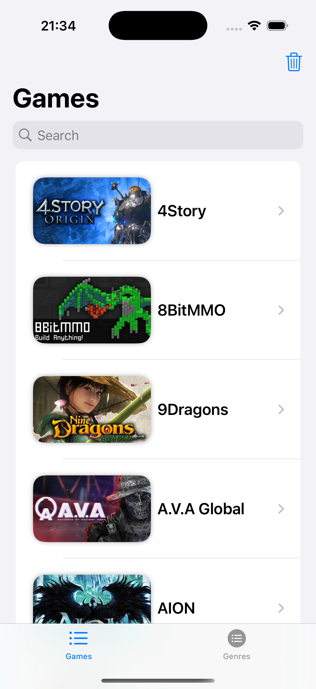
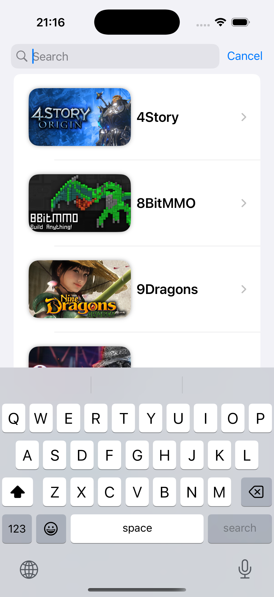
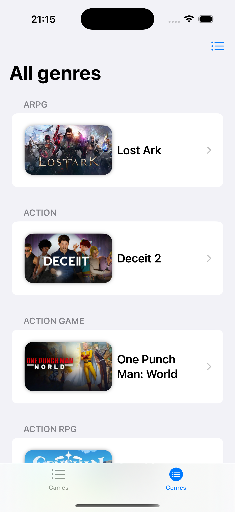
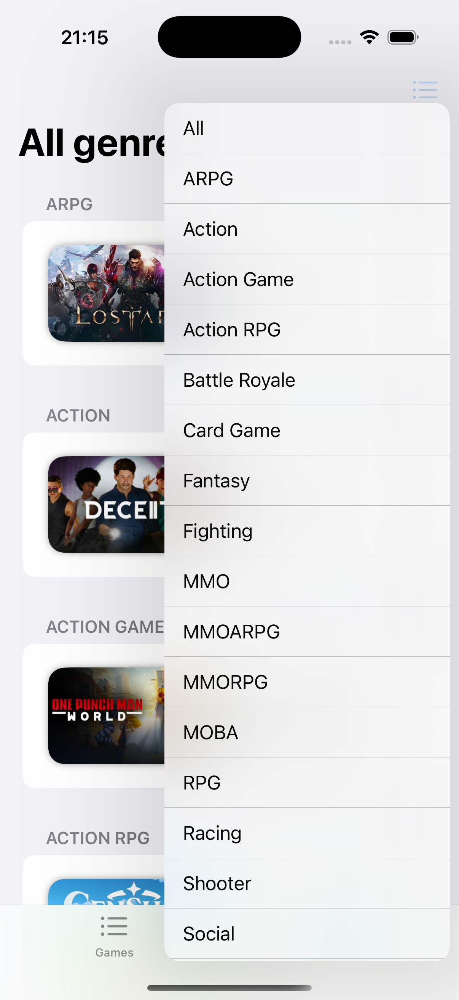
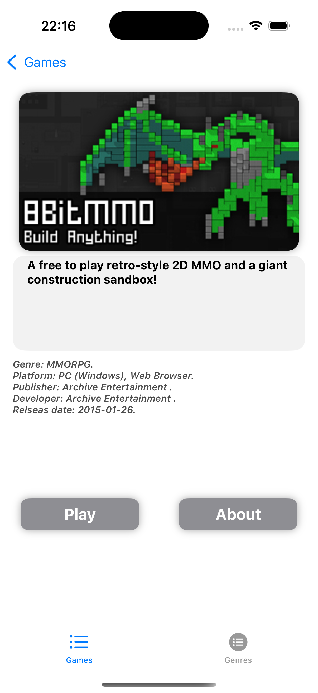

# FreeToPlay games list.
##WIP

Приложение написано при помощи swiftUI на архитектуре MVVM. Использовался API freetogame.com. 
В приложении реализован networkManager отвечающий за работу с сетью. А так же AsyncImageCache
для кэширования изображений.
Реализовано 3 экрана:
1. Список игр с поисковой строкой и кнопкой очистки кэша.
2. Список по жанрам игр и возможностью фильтрации по жанру.
3. Детальная информация по игре. В этот экран мы попадаем по нажатию на игру в списке.

## Скриншоты

  
  
  
  
  

